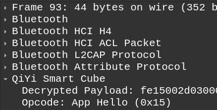

To install the plugin:
- Open wireshark
- Go to Help->About Wireshark->Folders
- Note the path for "Personal Lua Plugins". Create the folder if it doesn't exist
- Copy the files `aes.lua` and `qiyi_smartcube.lua` from this repo into the plugin folder
- (Restart Wireshark)

To live-capture bluetooth traffic on Android:
- [Connect to your device with `adb`](https://developer.android.com/tools/adb)
- Open Wireshark and select "Android Bluetooth Btsnoop"
- Connect your cube to the QiYi app and start using it normally, bluetooth packets will be shown live in Wireshark

The plugin automatically decrypts messages and shows them in the "Packet Details" view:

